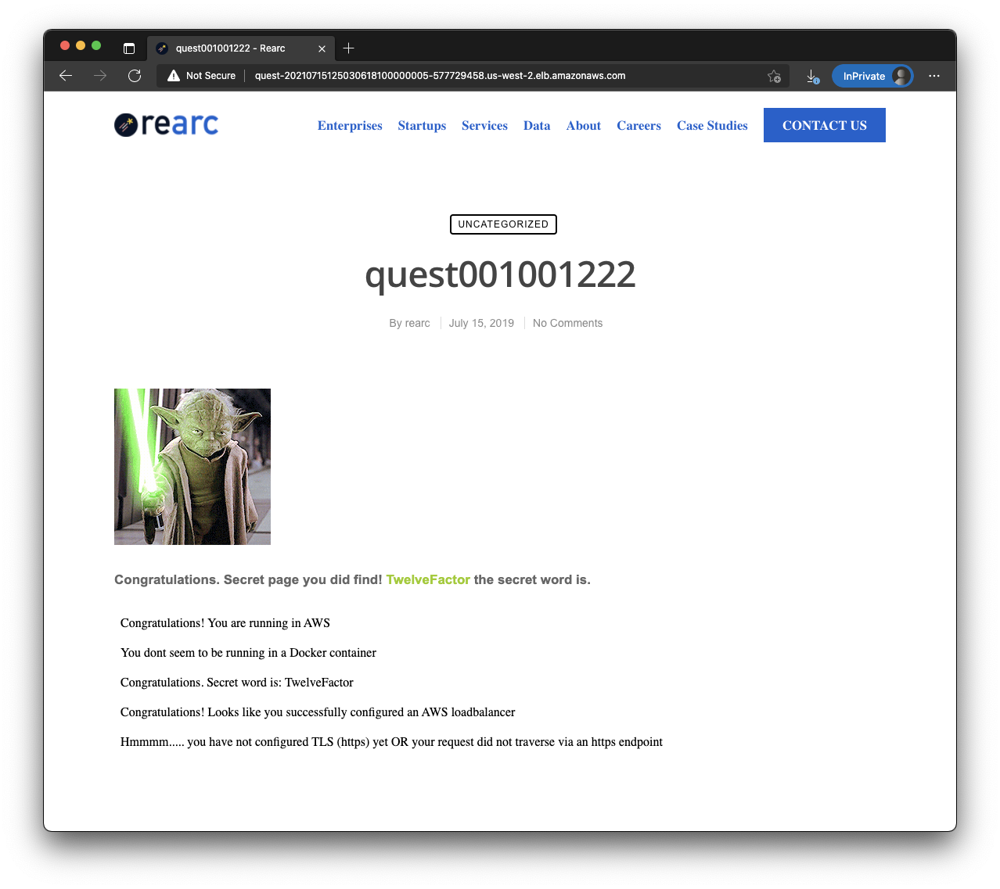

## Overview
Simple ECS based deployment of a Node app for Rearc.

## Make it so
* Run `terraform init` and `terraform apply` to deploy. Default values should be specific, but see input variables
  below.
* Open codebuild and run the build to publish the container in ECR (note: codebuild containers often hit docker rate
  limits which can be mitigated with a docker login)
* The link to the load balancer is in the terraform output

## Limitations
* Source code: Normally codepipeline would be triggered with a github webhook. As I can't assume a github login,
  I've left this to be a manual step. (Addendum: A github login could have been set up as an input variable).
* TLS: ACM requires a route53 domain so I have skipped it for this demo. However, it is easy to add by passing in a
  zone, registering an ACM cert, and attaching it to an HTTPS listener. Then redirect the HTTP listener with a
  permanent 301 redirect to HTTPS to get edge based encryption.
* TLS internal: As this doesn't involve node, I did not configure node with a cert frontend in the docker container
  which would handle zero trust design inside the AWS network.

## Screen Shot

## Requirements

| Name | Version |
|------|---------|
| terraform | >= 0.15 |
| aws | >= 3 |

## Providers

| Name | Version |
|------|---------|
| aws | >= 3 |

## Inputs

| Name | Description | Type | Default | Required |
|------|-------------|------|---------|:--------:|
| app\_port | The port used by the application | `number` | `3000` | no |
| app\_secret | The secret word to pass to the container (set using TFVAR\_ or other secure method) | `string` | `"not a secret"` | no |
| num\_subnets\_private | Number of public subnets to create (minimum 2 for load balancers) | `number` | `2` | no |
| num\_subnets\_public | Number of public subnets to create (minimum 2 for load balancers) | `number` | `2` | no |
| num\_zones | Number of availability zones to use within the region | `number` | `2` | no |
| region | The region to deploy resources in | `string` | `"us-west-2"` | no |
| subnet\_mask | Number of bits for netmask to use with subnets | `number` | `23` | no |
| tags | Default tags to be used with AWS resources | `map(string)` | <pre>{   "Application": "Quest",   "Billing": "Rearc",   "Contact": "daniel.babel@gmail.com",   "Provisioner": "Terraform" }</pre> | no |
| vpc\_cidr | Network CIDR for the VPC | `string` | `"10.0.0.0/16"` | no |

## Outputs

| Name | Description |
|------|-------------|
| codebuild | Codebuild project name and the region it's found in |
| web\_urls | Supported URL's to the app (excluding https as it's not implemented) |

